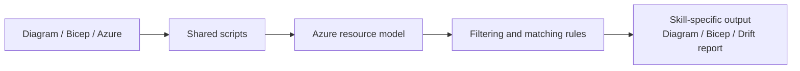

# AzVerify shared skill architecture

This folder contains the shared contracts, reference data, procedures, and scripts used by the nine AzVerify skills.

## Folder layout

| Path | Purpose |
|---|---|
| `azure-resource-model.md` | Canonical resource-model contract shared by diagram, Bicep, and Azure comparisons. |
| `azure-resource-configs.md` | Human-readable configuration guidance, defaults, and comparison notes per Azure resource type. |
| `azure-deployment-verification.md` | Pre-deployment validation rules used before generating Bicep or Azure update guidance. |
| `azure-stencil-mapping.json` | Draw.io stencil lookup for Azure resource types. |
| `bicep-best-practices.md` | Repository-specific Bicep authoring rules. |
| `drawio-diagram-conventions.md` | Diagram layout, containment, and edge conventions. |
| `version-currency.md` | Version and runtime currency checks. |
| `procedures/` | Script contracts and step-level procedures that skills reference instead of re-describing algorithms inline. |
| `data/` | Machine-readable lookup data consumed by scripts. |
| `scripts/` | PowerShell automation that performs parsing, filtering, matching, discovery, and fixture validation. |

## Architecture overview

AzVerify skills follow a shared pipeline:

1. **Collect inputs** from the user, workspace, diagram, Bicep, or Azure scope.
2. **Run shared scripts** to convert source material into the common resource-model contract.
3. **Apply shared data and rules** for filtering, property extraction, matching, and validation.
4. **Generate or compare outputs** in the skill-specific format.

## Resource-model contract

All script-backed flows normalize data into the contract documented in `azure-resource-model.md`.

Core fields:

- `id`
- `type`
- `name`
- `resourceGroup`
- `location`
- `properties`
- `tags`
- `relationships`

This contract lets one parser feed multiple downstream skills. For example, a diagram parser and a Bicep parser both emit the same shape, so `Compare-ResourceModels.ps1` can compare them without skill-specific logic.

## Data files

| File | Used by | Notes |
|---|---|---|
| `data/resource-filter-rules.json` | `Select-AzureResources.ps1` and filtering procedures | Encodes diagram vs Bicep inclusion rules. |
| `data/azure-property-paths.json` | `Get-AzureResourceModel.ps1`, deep sync skills | Maps resource types to property paths, MCP hints, CLI fallbacks, and composite extraction rules. |

Keep these files machine-readable and stable. Skills should reference them through scripts or procedure docs rather than re-embedding the tables inline.

## Scripts

All scripts live in `scripts/` and are designed to emit JSON to stdout or an output file.

### Runtime prerequisites

- **PowerShell 5.1 (powershell.exe) or higher (`pwsh`)** is required.
- **Azure CLI (`az`)** is required for Azure-backed discovery and authentication checks.
- **Bicep CLI support** is required for the primary Bicep build path. `ConvertFrom-BicepTemplate.ps1` can use `az bicep build` or standalone `bicep`.

If a required prerequisite is unavailable, the calling skill will try the MCP first. If the MCP is unavailable, it must report the prerequisite and stop at the documented hard gate.

### Script contracts

Each script has a matching procedure document in `procedures/` when the skill needs a stable invocation contract. Skills should cite the procedure doc and run the script, not restate the implementation.

## How skills compose shared assets

- **Reverse-engineering skills** use Azure authentication, Azure discovery, filtering, and resource-model normalization.
- **Generation skills** use diagram parsing plus Bicep best practices and deployment verification.
- **Drift and validation skills** combine two normalized models, then use matching and property-path data for comparison.

The intended pattern inside a `SKILL.md` file is:

1. Keep the skill body lean.
2. Point to the relevant shared procedure or reference file.
3. Invoke the script or follow the contract.
4. Present only the skill-specific decision points and outputs.

## Maintenance guidance

- Put durable algorithms in `scripts/`.
- Put stable invocation details in `procedures/`.
- Put lookup tables in `data/`.
- Keep `SKILL.md` files focused on triggers, inputs, outputs, and orchestration.

When adding a new shared script, also add or update the corresponding procedure contract and document it in `scripts/README.md`.