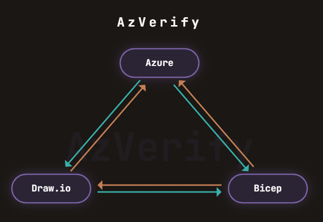

# AzVerify

Your Azure diagram, your Bicep templates, and your live environment are three separate sources of truth. They can drift apart.

AzVerify gives GitHub Copilot the skills to connect them.



## Quick Start

1. Sign in to GitHub Copilot Chat in VS Code (requires GitHub Copilot subscription) (or use the CopilotCLI, see [Getting Started](docs/getting-started.md))
2. Install the [Draw.io VS Code extension](https://marketplace.visualstudio.com/items?itemName=hediet.vscode-drawio)
3. For best results, Install MCP servers: [Draw.io MCP](https://mcp.draw.io/mcp) and [Azure MCP](https://github.com/microsoft/mcp/tree/main/servers/Azure.Mcp.Server) in VS Code
4. Clone this repo: `git clone https://github.com/Ba4bes/AzVerify.git`
5. Run a skill: Open Copilot Chat and try:
   ```text
   /azv-azure-to-diagram run Resource Group `<your-rg>`, Subscription `<your-sub-id>`
   ```

See [docs/getting-started.md](docs/getting-started.md) for the full walkthrough.

## Skills

### Reverse-Engineer from Live Azure

| Skill | What it does |
|-------|-------------|
| **Azure-to-Diagram** | Discover resources in a live Azure scope and generate a Draw.io architecture diagram |
| **Azure-to-Bicep** | Reverse-engineer a live Azure scope into deployment-ready Bicep templates with parameter files |

### Generate from Diagrams and Descriptions

| Skill | What it does |
|-------|-------------|
| **Sketch-to-Diagram** | Convert a rough sketch or text description into a professional Draw.io Azure architecture diagram |
| **Diagram-to-Bicep** | Generate modular Bicep templates from a Draw.io diagram, with pre-deployment verification |

### Detect and Resolve Drift

| Skill | What it does |
|-------|-------------|
| **Diagram-Azure-Sync** | Compare a Draw.io diagram against live Azure — quick (existence) or deep (property-level) |
| **Bicep-Diagram-Sync** | Compare Bicep templates against their source diagram and resolve divergence |

### Validate Before Deploying

| Skill | What it does |
|-------|-------------|
| **Bicep-What-If** | Preview what would change if you deployed — Create, Modify, Delete, No Change |
| **Bicep-Policy-Check** | Check Bicep against Azure Policy assignments in the target environment |

## Examples
The [examples/](examples/) folder contains skill outputs and inputs from several scenarios. Note: some example folder names were renamed; use the directories shown below.

| Example Directory | What it demonstrates |
|-------------------|---------------------|
| [examples/azure-to-diagram-contoso-voting](examples/azure-to-diagram-contoso-voting/) | Reverse-engineered App Service + Key Vault + Storage + EventGrid |
| [examples/sketch-to-diagram-resourcegroup01](examples/sketch-to-diagram-resourcegroup01/) | Sketch → Diagram → Bicep pipeline with validation reports |
| [examples/description-to-diagram-securewebapp](examples/description-to-diagram-securewebapp/) | WAF-protected web app with Application Gateway, SQL, and Private Endpoints |
| [examples/azure-to-diagram-contoso-notify](examples/azure-to-diagram-contoso-notify/) | Function App / other pipelines (folder name preserved as-is in repo) |

## Documentation

| Document | Purpose |
|----------|---------|
| [Getting Started](docs/getting-started.md) | Prerequisites, MCP setup, first skill walkthrough |
| [Example Prompts](docs/example-prompts.md) | Copy-paste prompts for every skill |
| [Test Run Tracker](docs/test-run-tracker.md) | Notes and results from skill test runs |

## Contributing

This project welcomes contributions and suggestions.  Most contributions require you to agree to a
Contributor License Agreement (CLA) declaring that you have the right to, and actually do, grant us
the rights to use your contribution. For details, visit [Contributor License Agreements](https://cla.opensource.microsoft.com).

When you submit a pull request, a CLA bot will automatically determine whether you need to provide
a CLA and decorate the PR appropriately (e.g., status check, comment). Simply follow the instructions
provided by the bot. You will only need to do this once across all repos using our CLA.

This project has adopted the [Microsoft Open Source Code of Conduct](https://opensource.microsoft.com/codeofconduct/).
For more information see the [Code of Conduct FAQ](https://opensource.microsoft.com/codeofconduct/faq/) or
contact [opencode@microsoft.com](mailto:opencode@microsoft.com) with any additional questions or comments.

## Trademarks

This project may contain trademarks or logos for projects, products, or services. Authorized use of Microsoft
trademarks or logos is subject to and must follow
[Microsoft's Trademark & Brand Guidelines](https://www.microsoft.com/legal/intellectualproperty/trademarks/usage/general).
Use of Microsoft trademarks or logos in modified versions of this project must not cause confusion or imply Microsoft sponsorship.
Any use of third-party trademarks or logos are subject to those third-party's policies.
