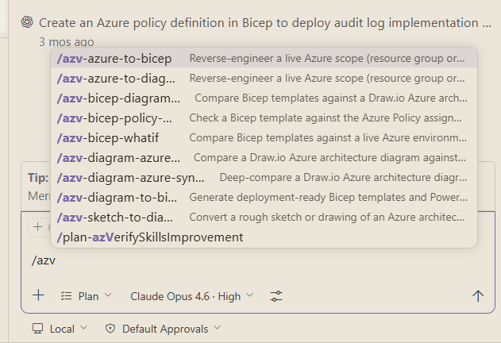

# Example Prompts

Copy-paste these prompts to try AzVerify skills. Replace placeholder values (like resource group names and subscription IDs) with your own.

All skills can be called by using `/azv` in the chat and selecting the skill from the dropdown, or by copy-pasting the full command with parameters.


---

## Reverse-Engineer from Live Azure

### Azure-to-Diagram

Discover resources in a live Azure resource group and generate a Draw.io architecture diagram.

```text
/azv-azure-to-diagram Resource Group `<your-resource-group>`,
Subscription `<your-subscription-id>`
```

### Azure-to-Bicep

Reverse-engineer a live Azure resource group into deployment-ready Bicep templates.

```text
/azv-azure-to-bicep Resource Group `<your-resource-group>`,
Subscription `<your-subscription-id>`
```

---

## Generate from Descriptions or Sketches

### Sketch-to-Diagram (from text description)

```text
/azv-sketch-to-diagram  `<path-to-description>.md`
```

```text
/azv-sketch-to-diagram  I'm building a small API using Azure Container Apps. The API connects to a Cosmos DB  (NoSQL) database. I want a Container Apps Environment with one Container App running my
API image. The Cosmos DB should be in the same resource group "rg-container-api". Add a Log Analytics workspace for the Container Apps Environment.
```

### Sketch-to-Diagram (from image)

```text
/azv-sketch-to-diagram `<path-to-sketch>.jpeg`
```

### Diagram-to-Bicep

Generate Bicep templates from an existing Draw.io diagram.

```text
/azv-diagram-to-bicep `<path-to-diagram>.drawio`
```

---

## Detect and Resolve Drift

### Bicep-Diagram Sync

Compare Bicep templates against their source diagram. Finds divergence and offers resolution.

```text
/azv-bicep-diagram-sync `<path-to-diagram>.drawio`,
bicep root `<path-to-bicep-folder>/`
```

### Diagram-Azure Sync

Compare a Draw.io diagram against a live Azure environment.

```text
/azv-diagram-azure-sync `<path-to-diagram>.drawio`,
Resource Group `<your-resource-group>`,
Subscription `<your-subscription-id>`
```

---

## Validate Before Deploying

### Bicep What-If

Preview what would change if you deployed your Bicep templates — without actually deploying.

```text
/azv-bicep-whatif  `<path-to-bicep-folder>/`,
Resource Group `<your-resource-group>`,
Subscription `<your-subscription-id>`
```

### Bicep Policy Check

Check your Bicep templates against the Azure policies active in your target environment.

```text
/azv-bicep-policy-check  `<path-to-bicep-folder>/`,
Resource Group `<your-resource-group>`,
Subscription `<your-subscription-id>`
```

---

## Using the Examples

The [examples/](../examples/) folder contains complete skill outputs you can use as inputs for downstream skills. For instance:

```text
# Generate Bicep from the Contoso-Voting example diagram
/azv-diagram-to-bicep `examples/contoso-voting/contoso-voting.drawio`

# Sync the Contoso-Notify diagram against its Bicep
/azv-bicep-diagram-sync `examples/contoso-notify/Contoso-Notify.drawio`,
bicep root `examples/contoso-notify/`

# Run what-if against a live environment using the securewebapp Bicep
/azv-bicep-whatif `examples/securewebapp/`,
Resource Group `<your-resource-group>`,
Subscription `<your-subscription-id>`
```
